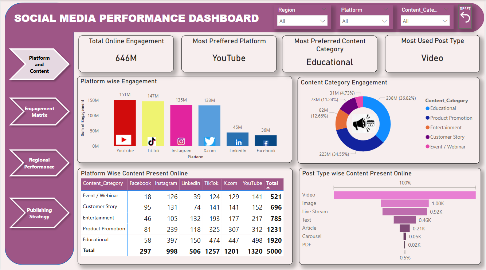
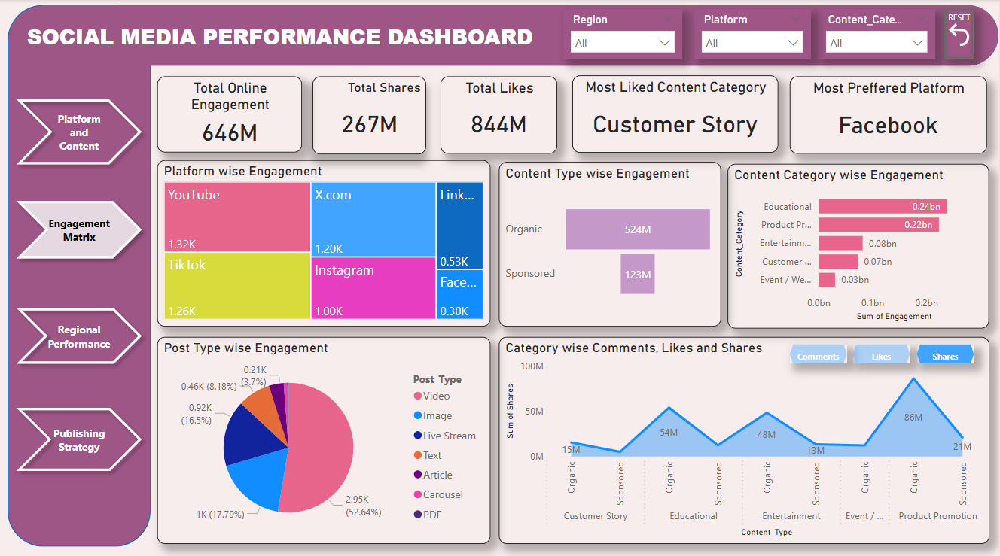
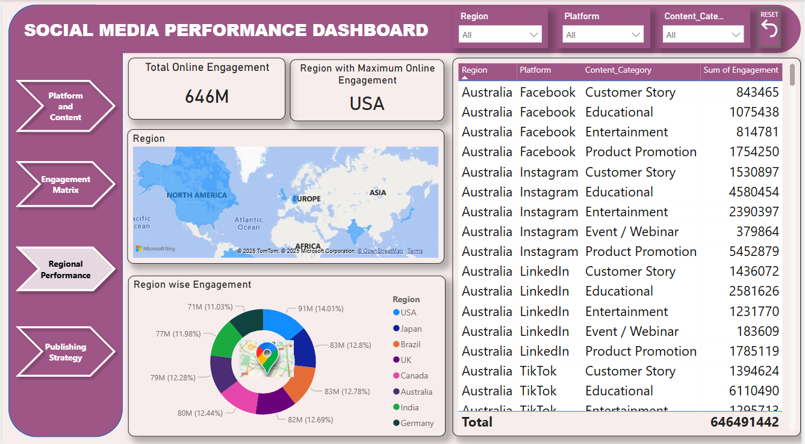
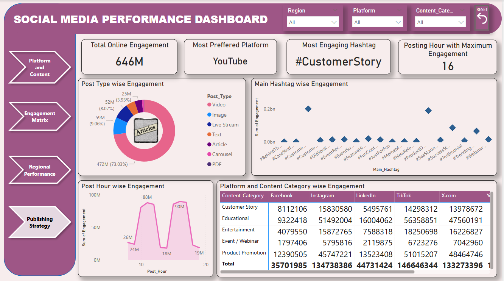

# Social_Media_Performance_Analysis_Dashboard

An interactive Power BI dashboard analyzing social media performance across platforms, content formats, posting time, and regions. This project converts engagement data into clear, actionable marketing insights. 

## Problem Statement

Social media decisions are often intuition-driven. This project uses engagement data to identify what works, where, and when.

## Objectives

-Compare platform-wise engagement

-Identify high-performing content formats & categories

-Analyze organic vs sponsored content impact

-Find optimal posting time

-Understand regional engagement trends

## Dashboard Preview 

## Key Insights

-Video-first strategy wins: Videos drive 73% of total engagement

-YouTube leads: Most preferred platform with 151M+ engagements

-Educational content performs best: Contributes 36.8% of engagement

-Organic > Sponsored: 4x higher engagement than paid content

-Customer Stories resonate: Most liked content & top hashtag (#CustomerStory)

-Best posting time: 4 PM (Hour 16) shows peak engagement

-Regional insight: USA leads; India, Brazil & Germany show strong growth

-Facebook underrated: Fewer engagements, but highest likes

-High-impact combo: Educational + Product Promotion = 70%+ engagement

## Business Value

# Enables data-driven decisions to:

-Optimize content strategy

-Improve campaign ROI

-Schedule posts at peak engagement times

-Tailor platform and region-specific strategies

## Tools & Technologies

-Power BI (DAX, interactive dashboards)

-Power Query (data cleaning & transformation)

-Excel / CSV dataset

## Connect with Me
If you'd like to engage with the discussion or view the original post, you can find it here:

🔗[Article Link](https://www.linkedin.com/feed/update/urn:li:activity:7341468237320097793/)

I regularly share insights on Business Analysis, SQL, Power BI, and analytics on LinkedIn.

🔗[LinkedIn Link](https://www.linkedin.com/in/shruti-gupta-16605018b/)
